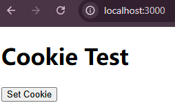
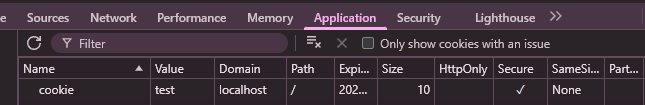

# FastAPI CORS Cookie Example

A simple example demonstrating how to set cookies across different domains using FastAPI with CORS support. 


## Requirements

1. Server
- FastAPI
- uvicorn
2. Frontend
- NodeJS 
- Express.js
- Nodemon  
- React + Axois (optional)

## Installation

1. Install dependencies:
```bash
pip install fastapi uvicorn
npm install express
npm install -g nodemon
```
2. React (Optional)
```
cd clientReact
npm install
```

## Usage

1. Start the FastAPI server:
```bash
uvicorn main:app --reload
```
The server will run at `http://localhost:8000`

2. Start the client web page:
```bash
nodemon client.js
```
The frontend will run at `http://localhost:3000`  

3.  (Optional) Start React client 
```
cd clientReact
npm run dev
```
The React frontend will run at `http://localhost:5173`  

4. Click `Set Cookie` button to fetch setcookie.  


5. Check the browser tool to see the cookie.  

## API Endpoints

### Set Cookie
- **URL**: `/setcookie/`
- **Method**: GET
- **Response**: `{"message": "Cookie set. Check in browser tools."} `
- **Cookie Properties**:
  - SameSite: None
  - Secure: True
  - Max Age: 10000 seconds

## CORS Configuration

The server is configured to:
- Accept requests from `http://localhost:3000`
- Allow credentials
- Accept GET, POST, and OPTIONS methods
- Allow all headers

## Note

Make sure your frontend application is running on `http://localhost:3000` and the backend is running on `http://localhost:8000` to work with the current CORS configuration.